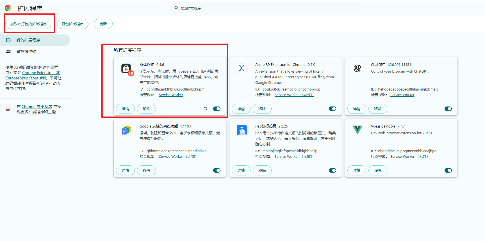

# JEV 双休购 · Chrome 插件版

**简体中文** | [English](README.en.md)

### 把对双休的支持，带进每一次购物。

逛淘宝、京东，顺手为双休投一票。JEV 根据商品、店铺和品牌线索猜测工作制，**疑似非双休，直接在商品图上盖一个 PASS。**

照常逛，自动判断。无需复制商品、切换窗口，也不用下载本地模型。

**[下载插件 ZIP ↓](https://github.com/littlewindy123/jev-weekend-shopping-chrome/archive/refs/heads/main.zip)**　·　[图文安装教程](docs/INSTALL.md)　·　[获取 JEV API Key](https://console.typesafe.ai/keys)

Chrome 137+ · v0.4.6 · MIT 开源 · 需填写自己的 TypeSafe API Key

## 用起来，就是这样

### 淘宝：边逛，边盖章

**不用离开淘宝，判断直接出现在商品上。** 0.4.5 用户实测截图：已判断 12 件，盖章 7 件，不盖章 5 件，商品图上只保留 PASS。

### 京东：原来的页面，多一层选择

**左边盖章，旁边照常展示。** 印章直接叠在商城原来的商品图片上，商品仍然可以点击。

*淘宝为用户提供的 0.4.5 实页截图；京东图沿用旧版。新版商品图上只显示 PASS，说明保留在面板与声明中。PASS 为 AI 猜测，不代表对商家用工制度的事实认定。*

- **边逛边判断**：滚动浏览，新进入视野的商品自动参与判断。
- **有店看店，没店看产品**：优先用店铺、品牌线索，没有就按商品文字猜测。
- **盖章或不盖章**：猜测非双休就盖 PASS，猜测双休就保持原样。
- **随时暂停**：关掉插件开关，页面上的印章随即移除。

## 四步开始用

| 步骤 | 你要做什么 |
| --- | --- |
| **① 下载** | [下载 ZIP](https://github.com/littlewindy123/jev-weekend-shopping-chrome/archive/refs/heads/main.zip)，解压到固定文件夹。 |
| **② 安装** | Chrome 打开 `chrome://extensions` → 开启「开发者模式」→「加载已解压的扩展程序」→ 选择含 `manifest.json` 的文件夹。 |
| **③ 开启** | 点工具栏拼图 →「双休购物」，填入自己的官方 Key →「保存并测试连接」→ 开启顶部开关。 |
| **④ 逛起来** | 刷新京东或淘宝商品列表，向下滚动。看商品上的 PASS 和左下角运行统计。 |

**不用安装 Node.js，不用运行代码，不用编译。** 下载的 ZIP 已包含完整插件。当前通过开发者模式安装，尚未上架 Chrome 应用商店。

**点左上角「加载未打包的扩展程序」，选择解压后直接包含 `manifest.json` 的文件夹。** 出现图中的购物袋图标和「双休购物 0.4.6」卡片，即加载成功。不要选 ZIP 文件，也不用点「打包扩展程序」。

第一次装浏览器插件？跟着 **[图文教程一步步操作 →](docs/INSTALL.md)**

## 常见问题

**连接成功，但页面没变化？** 先开启开关，再刷新商城页。左下角有运行统计，才说明页面脚本已经连接；不盖章也可能是模型判断为双休。报错时打开插件查看提示。

**每次打开都要下载模型？** 不需要。使用官方 JEV 在线判断，Key 和开关保存在本机。

**怎么更新？** 用新版文件替换原安装目录，在扩展管理页点「重新加载」，然后刷新商城页。保留原扩展即可保留设置。

## 声明

- **AI 猜测，仅供参考。** 商品信息不能证明企业作息；盖章和未盖章均不构成企业认证。
- **插件免费开源，API 使用自己的额度。** 费用与赠送额度以 TypeSafe 账户及官方规则为准。
- **数据与隐私。** 判断所需商品文字发送至 TypeSafe；不采集 Cookie、订单或聊天记录。Key 仅保存在本机扩展存储中并发送给官方接口。
- **适配范围。** 支持京东首页、搜索/列表及淘宝首页/搜索的适配。京东、淘宝首页均已有实页盖章截图；部分活动页和详情页暂不支持，网站改版可能影响适配。

## 参与项目

觉得这个想法有意思，欢迎 **Star**，或把项目分享给同样在意双休的人。

[反馈问题](https://github.com/littlewindy123/jev-weekend-shopping-chrome/issues) · [原理与开发](docs/DEVELOPMENT.md) · [测试记录](docs/TESTING.md) · [MIT](LICENSE)

独立社区项目，与 TypeSafe、京东、淘宝无官方隶属关系。第三方说明见 [THIRD_PARTY.md](THIRD_PARTY.md)。
