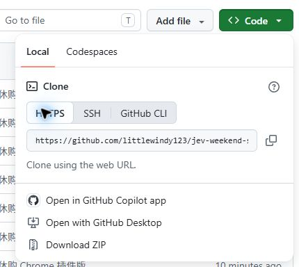
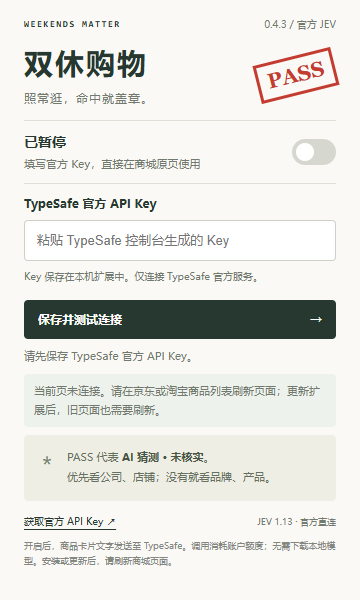
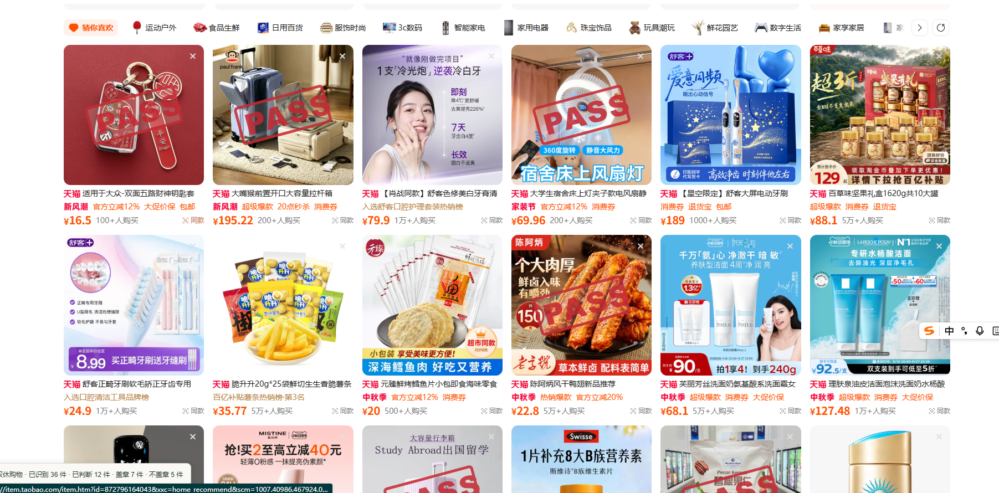

# 从下载到第一次盖章

准备：桌面版 Chrome 137 或更新版本，以及你自己的 [TypeSafe 官方 API Key](https://console.typesafe.ai/keys)。不需要编程环境。

## 1. 下载并解压

**[点击下载完整插件 ZIP](https://github.com/littlewindy123/jev-weekend-shopping-chrome/archive/refs/heads/main.zip)**

也可以在仓库首页点绿色 **Code → Download ZIP**。

下载后右键 ZIP，选择「全部解压」。把文件夹放在固定位置；安装后 Chrome 仍然要从这里读取插件，别删掉或随意移动。

打开解压后的文件夹，确认能直接看到 **`manifest.json`**。后面安装时，就选这一层文件夹。

## 2. 加载到 Chrome

1. 在 Chrome 地址栏输入 `chrome://extensions`，按回车。
2. 打开右上角的 **开发者模式**。
3. 点击左上角 **加载已解压的扩展程序**。有些版本显示为「加载未打包的扩展程序」。
4. 选择刚才包含 `manifest.json` 的文件夹，确认选择。

页面出现 **双休购物 0.4.5** 卡片，即已加载成功。不要选择 ZIP 文件，也不要选择外面多套的一层空文件夹。

## 3. 填写 Key，打开开关

点击 Chrome 右上角拼图图标 → **双休购物**。可以点旁边的图钉，方便下次打开。

按下面顺序操作：

1. **填 Key**：从 TypeSafe 控制台复制自己生成的 API Key，粘贴到中间输入框。
2. **测连接**：点击「保存并测试连接」，等待「官方 JEV 连接成功」。
3. **开开关**：打开面板顶部开关，看到「已开启」。

图中是 0.4.3 尚未配置的初始面板，0.4.5 操作相同，故显示「已暂停」。连接测试会发送一个虚构商品请求；不要把自己的 Key 发到 Issue 或公开截图里。

## 4. 回商城，刷新后往下逛

打开 [京东首页](https://www.jd.com/) 的「为你推荐」，或京东、淘宝商品列表。**如果安装前已经打开了商城，请先刷新一次页面。**

关闭插件面板，正常向下滚动。模型猜测非双休时，会直接在原商品图片上盖 PASS：

左边的 PASS 是插件加上的；相邻商品保持原样，盖章仍可点击商品。截图来自旧版；0.4.5 起商品图只显示 PASS，不再显示下面的小字，相关说明保留在插件面板与声明中。

淘宝也是直接在原商品图上盖章，下面是用户提供的 0.4.5 实际运行截图，商品图上只显示 PASS：

左下角的运行统计可以帮助确认它是否工作：**已识别 → 已判断 → 盖章 / 不盖章**。请求失败会单独提示，不会伪装成双休判断。

## 没看到效果时

| 现象 | 怎么处理 |
| --- | --- |
| 面板显示「当前页未连接」 | 切回支持的商城页面并刷新，再打开面板。 |
| 显示「已暂停」 | 检查 Key 已保存，打开顶部开关。 |
| 判断数在增加，但没有 PASS | 本批商品可能都被猜测为双休，继续滚动看其他商品。 |
| 提示 Key、网络、限流或额度问题 | 按面板错误提示检查官方账户或网络，稍后重试。 |
| 某些页面一直识别不到商品 | 当前不支持所有活动页和详情页；可先在京东首页推荐列表尝试。 |

## 更新与暂停

- **更新**：下载新版，替换原安装目录的文件 → 在扩展管理页点击双休购物卡片的「重新加载」→ 刷新商城页。无需先移除旧扩展。
- **暂停**：关闭顶部开关，页面印章会被移除。

[返回项目首页](../README.md) · [反馈问题](https://github.com/littlewindy123/jev-weekend-shopping-chrome/issues)
